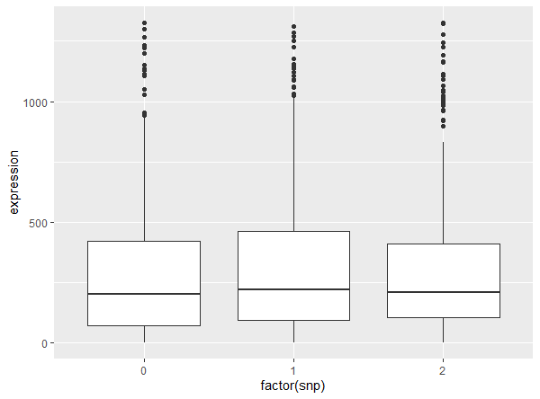

# SCeQTL 


SCeQTL is an R package that uses zero-inflated negative binomial regression to do eQTL analysis on single-cell data. It can distinguish two type of gene-expression differences among different genotype groups. It’s more suitable to use SCeQTL to identify eQTLs from single-cell data. It can also be used for finding gene expression variations associated with other grouping factors like cell lineages. Following is the detail information and usage of this program. You can also found them in READ.ME. [R
Packages](http://r-pkgs.had.co.nz/) is a book based around this workflow.
## Authors
Hu Yue <y-hu10@qq.com>

Xi Xi <xwx9798@gmail.com>


## Installation

To install the developmental version from [GitHub](https://github.com/XuegongLab/SCeQTL) (recommended):

```r
if(!require(devtools)) install.packages("devtools")
devtools::install_github("XuegongLab/SCeQTL")
```

To install from source package, you could download the R package from [Mac and Linux version](http://github.com/XuegongLab/SCeQTL/tree/master/sourcefile/SCeQTL_0.2.0.tar.gz) or [Windows version](http://github.com/XuegongLab/SCeQTL/tree/master/sourcefile/SCeQTL_0.2.0.zip) and run the command in R:

```r
install.packages(<source_code_file>, repos=NULL, type="source")
```

## Requirement

### Prerequisite(R-packages): 
       qvalue
       ggplot2
       doParallel
       pscl(<=1.5.2)

## Input:

**`SCeQTL`** takes two inputs: `gene` and `snp`.

The input `gene` is a scRNA-seq **raw read counts matrix**. The rows of the matrix are genes and columns are cells.

The other input `snp` is a **genotype matrix**, where each element should be 0/1/2 indicating three types of genotypes. The order of columns should be the same with `gene`.

## TestData:
Users can load the test data in **`SCeQTL`** by

```{r Load TestData}
library(SCeQTL)
data(test)
```

The toy data `gene` in `test` is a scRNA-seq read counts matrix which has 151 genes (rows) and 1529 cells (columns).

```{r gene}
dim(gene)
gene[1:6, 1:6]
```

The object `snp` in `test` is a matrix of genotype which has three levels and equal length to the column number of `snp`.

```{r group}
dim(snp)
snp[1:6, 1:6]
```


## Usage

Here is an example to run **`SCeQTL`** with read counts matrix input:

```{r demo1, eval = FALSE}
# Load library and the test data for SCeQTL
library(SCeQTL)
data(test)

# check whether the non-zero part could fit negative binomial well
# This function may fail since It's possible that the random picked gene can't be fit to negative bionomial distribution, all zero value for example
checkdist(gene)

# normalize gene matrix using DEseq method
normalize(gene)

# Detecting the SCeQTL
result <- cal.pvalue(gene, snp)

# Picking one sample to visualize
check.sample(gene[1,], snp[1,])
```

## Output
SCeQTL will output the p-value of each gene-snp pair. You could also get q-value by running `cal.qvalue(gene, snp)` instead of `cal.pvalue(gene, snp)`.

```{r demo1, eval = FALSE}
SCeQTL::cal.qvalue(gene[1:10,], snp)
```

 The result is like the picture below. 


Then you may interested in the significant gene-snp pairs. You could stat and visualize it by `check.sample`. Here take the most significant pair for example.

```{r demo1, eval = FALSE}
SCeQTL::check.sample(gene["CDC5L",], snp[10, ])
```

Then you could get the statistic about the pair and a boxplot showing the relationship.

```
zero ratio of group 0 0.02004008 
zero ratio of group 1 0.006944444 
zero ratio of group 2 0 
mean of group 0:  286.8818 
mean of group 1:  302.4861 
mean of group 2:  318.8277 
non-zero part mean of group 0:  292.7485 
non-zero part mean of group 1:  304.6014 
non-zero part mean of group 2:  318.8277 
non-zero part standard error of group 0:  282.2443 
non-zero part standard error of group 1:  292.6688 
non-zero part standard error of group 2:  288.2995 
```


Before run `cal.qvalue`, you may want to check whether the distribution fit the bionomial negative assumption well by `checkdist`

```
checkdist(gene)
```

A Q-Q plot will be shown. It will randomly pick some genes so you may get different kind of result.


## Help


Use the following code in R to get access to the help documentation for **`DEsingle`**:

```{r help1, eval = FALSE}
# Documentation for checking and preparing gene expression dataset
?checkdist
?normalize
```

```{r help1, eval = FALSE}
# Documentation for finding single cell eQTL
?cal.pvalue
?cal.qvalue
```

```{r help2, eval = FALSE}
# Documentation for checking single gene-snp pair
?check.sample
```

```{r help3, eval = FALSE}
# Documentation for TestData
?test
?snp
?group
```

You are also welcome to contact the author by email for help.

## Code of conduct

Please note that the SCeQTL project is released with a [Contributor Code of Conduct](.github/CODE_OF_CONDUCT.md). By contributing to this project, you agree to abide by its terms.
